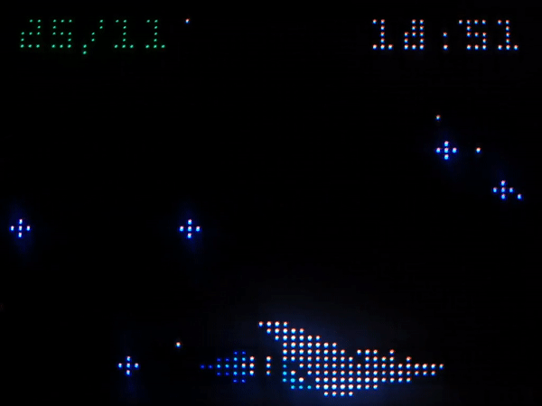
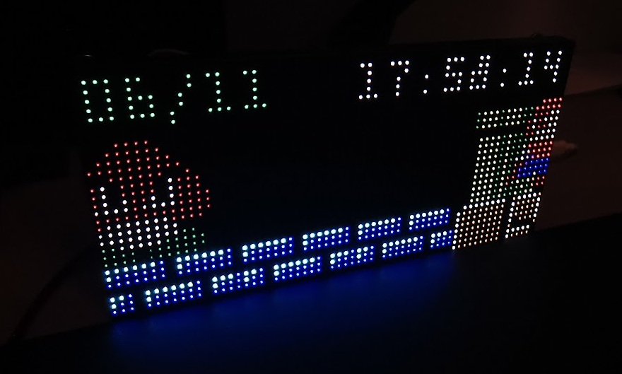

# Matrix Portal M4 MQTT Framework

Simple lightweight MQTT based framework for driving HUB75 LED panels such as AdaFruit's [64x64 HUB75E LED Matrix Panel](https://www.adafruit.com/product/3649), with the [AdaFruit Matrix Portal M4](https://www.adafruit.com/product/4745) controller board.

#### Video

 

#### Photos

## Requirements

- [AdaFruit Matrix Portal M4](https://www.adafruit.com/product/4745) RGB LED matrix controller
- Any compatible 64x64 pixel HUB75E LED matrix panel, such as [AdaFruit 64x64 Matrix](https://www.adafruit.com/product/3649)
- USB-C (5v/3A) power supply or powered hub
- WiFi access point

## Usage

Create a Python `virtualenv` and install the [CircUp](https://github.com/adafruit/circup) library manager:

    python -m venv ./venv
    source ./venv/bin/activate
    pip install circup

Connect the Matrix Portal M4 to device and confirm USB device is connected and automatically mounted (e.g. `/media/${USER}/CIRCUITPY`):

    ls /dev/ttyACM0
    ls /media/${USER}/CIRCUITPY

Install project dependencies and libraries using `circup`:

    circup install -r ./requirements.txt

Copy the contents of the `src` directory to the root of your Matrix Portal M4 filesystem (e.g. `/media/${USER}/CIRCUITPY`):

    rsync -rv ./src/ /media/${USER}/CIRCUITPY/

Now create a `secrets.py` file in the same location (e.g. `/media/${USER}/CIRCUITPY/secrets.py`). See the included [secrets.py.example](./secrets.py.example) for all possible configuration options and default values.

CircuitPython will automatically restart when files are copied to or changed on the device.
